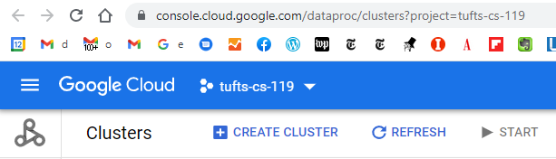
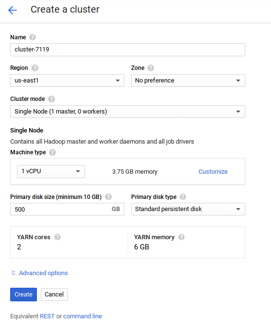
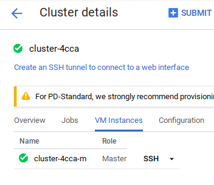
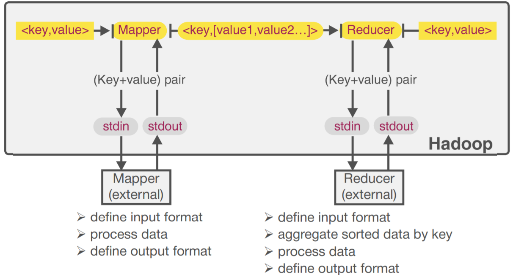

# Hadoop on GCP Dataproc

This note records the Hadoop/Dataproc workflow used in the Spring 2024 big data labs. It assumes the repository has been cloned onto the Dataproc cluster master node.

```bash
git clone https://github.com/<your-github-username>/big-data-labs-spring-2024.git
cd big-data-labs-spring-2024
```

## Goal

The lab builds a baseline Hadoop workflow:

1. Create a Google Cloud Dataproc cluster.
2. SSH into the cluster master.
3. Stage local repository data onto the master node.
4. Move text files into HDFS.
5. Run Hadoop's built-in word count.
6. Run Hadoop Streaming with a custom Python mapper.
7. Run Hadoop Streaming with both a custom Python mapper and reducer.

## Create A Dataproc Cluster

Open [Google Cloud Dataproc](https://console.cloud.google.com/dataproc/) and create a cluster on Compute Engine.

Useful setup screenshots are preserved locally:

- 
- 
- 

For small coursework runs, a single-node cluster can be enough, but under-powered configurations may fail during Spark or Hadoop jobs. After the cluster starts, SSH into the master node from the Dataproc console.



Check the installed Hadoop version:

```bash
hadoop version
```

## Stage Books Into HDFS

The five-book text corpus now lives in [`data/books`](../data/books).

```bash
hadoop fs -mkdir -p /user/$USER/five-books
hadoop fs -put data/books/* /user/$USER/five-books
hadoop fs -ls /user/$USER/five-books
```

Expected files:

- `a_tangled_tale.txt`
- `alice_in_wonderland.txt`
- `sylvie_and_bruno.txt`
- `symbolic_logic.txt`
- `the_game_of_logic.txt`

## Run Built-In Hadoop Word Count

Use Hadoop's packaged MapReduce example to confirm that the cluster and HDFS input are working.

```bash
hadoop jar /usr/lib/hadoop-mapreduce/hadoop-mapreduce-examples.jar \
  wordcount /user/$USER/five-books /user/$USER/books-count
```

The output directory must not already exist. If you rerun the command, delete the old HDFS output directory or choose a new output path.

Inspect the result:

```bash
hadoop fs -ls /user/$USER/books-count
hadoop fs -cat /user/$USER/books-count/part-r-00000 | head
```

## Run Hadoop Streaming With A Custom Mapper

Hadoop Streaming lets Python scripts act as mapper/reducer programs.



Run the mapper from [`labs/hadoop-streaming/mapper_noll.py`](../labs/hadoop-streaming/mapper_noll.py) with Hadoop's aggregate reducer:

```bash
mapred streaming \
  -file labs/hadoop-streaming/mapper_noll.py \
  -mapper mapper_noll.py \
  -input /user/$USER/five-books \
  -reducer aggregate \
  -output /user/$USER/books-stream-count
```

## Run Hadoop Streaming With A Custom Reducer

Use both the custom mapper and reducer from [`labs/hadoop-streaming`](../labs/hadoop-streaming).

```bash
mapred streaming \
  -file labs/hadoop-streaming/mapper_noll.py \
  -mapper mapper_noll.py \
  -file labs/hadoop-streaming/reducer_noll.py \
  -reducer reducer_noll.py \
  -input /user/$USER/five-books \
  -output /user/$USER/books-custom-counts
```

Inspect output:

```bash
hadoop fs -cat /user/$USER/books-custom-counts/part-r-00000 | head
```

## Related Exercises

- [`labs/tf-idf`](../labs/tf-idf): TF-IDF starter exercise using Hadoop Streaming style mapper/reducer code
- [`docs/hive-on-gcp.md`](hive-on-gcp.md): Hive external table over Hadoop output

## Common Issues

- **Existing output directories:** Hadoop jobs fail when the output path already exists.
- **Line endings:** Scripts created on Windows may need Unix line endings before running in Hadoop Streaming.
- **Executable permissions:** If Hadoop cannot execute a mapper or reducer, run `chmod +x` on the script.
- **Version mismatch:** Match Hadoop Streaming documentation to the Hadoop version installed on the cluster.

Delete or stop the Dataproc cluster when the lab is complete to avoid cloud charges.
